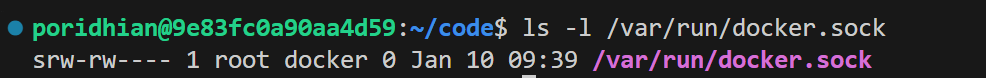
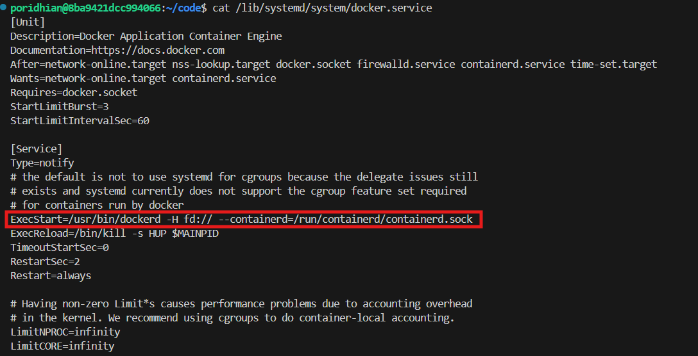
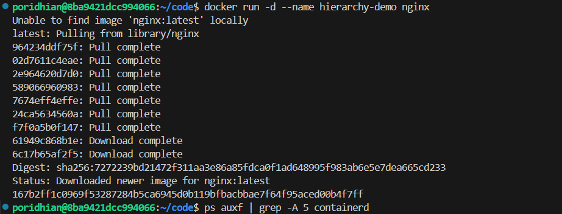
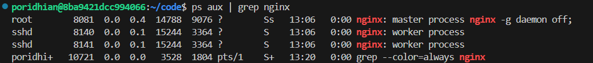
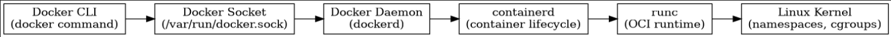

# Lab 1 – Docker Fundamentals

Understand Docker, containerd, and how containers run. Explore Docker's core components and architecture, and inspect the Docker daemon and runtime environment.


## Objectives
By the end of this lab, you will be able to:
- Explain the relationship between Docker, containerd, and runc
- Visualize Docker's client-server architecture and components
- Inspect and interpret Docker daemon configuration and runtime state
- Understand how containers are created via the OCI (Open Container Initiative) standards
- Identify key Docker resources: images, containers, volumes, and networks
- Troubleshoot basic Docker installation issues using diagnostic commands


## Background

### The Problem: "It Works on My Machine"

Before Docker, developers faced a classic problem: **environment inconsistency**. An application would work perfectly on a developer's laptop but fail in production due to different OS versions, missing dependencies, or conflicting library versions.

**Traditional Solutions Had Flaws:**
- **Virtual Machines**: Heavy (GBs in size), slow to start (minutes), inefficient resource usage
- **Configuration Management**: Complex scripts (Chef, Puppet) that were brittle and hard to maintain
- **Manual Documentation**: "README.md" setup instructions that were always outdated

### How Docker Solves This

Docker packages applications into **containers**: lightweight, portable, self-contained environments that run anywhere Docker is installed. But Docker itself is more than just a container runner—it's a **complete ecosystem** of tools working together.

**What We'll Explore in This Lab:**
Most developers use `docker run` without understanding what's happening under the hood. In this lab, we'll peel back the layers and explore Docker's architecture from the ground up.


## Docker Architecture Deep Dive

### The Complete Container Runtime Stack


**The Four Layers:**
1. **Docker CLI** (`docker`): The command-line interface you interact with
2. **Docker Daemon** (`dockerd`): The background service managing everything
3. **containerd**: The industry-standard container runtime managing container lifecycle
4. **runc**: The low-level runtime that actually runs containers

### Why This Separation Matters


**Docker's Evolution:**
- **2013**: Docker was monolithic (did everything)
- **2016**: Docker spun out containerd into a separate project
- **2017**: containerd became a CNCF graduation project
- **2019**: Docker further modularized, adopting OCI standards

**This separation means:**
- **containerd** can be used by other tools (Kubernetes, podman, etc.)
- **runc** can be swapped with other OCI-compliant runtimes (Kata, gVisor)
- **Docker** focuses on developer experience while standardizing the core

## Docker Client-Server Communication

### How Commands Flow Through the System


**When you run `docker run nginx`:**
1. **Docker CLI** reads your command and converts it to a REST API call
2. **Docker Socket** (`/var/run/docker.sock`) receives the call
3. **Docker Daemon** processes the request, pulls the image if needed
4. **containerd** is instructed to create and start the container
5. **runc** executes the actual container process using Linux namespaces/cgroups

---

## Understanding the OCI Standards

### The Open Container Initiative

**Two Key Specifications:**
1. **OCI Runtime Specification**: Defines how to run containers (implemented by runc)
2. **OCI Image Specification**: Defines the image format (used by Docker Hub, etc.)

**Why This Matters:**
- **Interoperability**: You can build an image with Docker and run it with podman
- **Standardization**: Industry-wide agreement prevents vendor lock-in
- **Innovation**: Different tools can compete on features while maintaining compatibility

## Step-by-Step Implementation Guide

### Step 1: Verify Docker Installation

First, let's ensure Docker is installed and running on your VM.

```bash
# Check if Docker command is available
which docker
```

**Expected output:**
```
/usr/bin/docker
```

```bash
# Check Docker service status
sudo systemctl status docker
```

**Expected output:**
```
● docker.service - Docker Application Container Engine
   Loaded: loaded (/lib/systemd/system/docker.service; enabled; vendor preset: enabled)
   Active: active (running) since ...
```

**If Docker is not running:**
```bash
sudo systemctl start docker
sudo systemctl enable docker
```

---

### Step 2: Explore Docker Version Information

Run the first diagnostic command to understand your Docker installation's components.

```bash
docker version
```

**Expected Output:**


**Analysis of Each Component:**

This command (`docker version`) shows you the exact **identity** of the software components.

Here is the analysis formatted for your documentation:

### 1. The Architecture Split (Client vs. Server)

*   **Client: Docker Engine - Community** / **Server: Docker Engine - Community**
    *   **What it is:** Proof that Docker is a client-server application. The **Client** is the CLI (Command Line Interface) you type into. The **Server** is the background daemon that does the work.
    *   **The Explanation:**
        *   The output is split into two distinct blocks. This confirms that your terminal (Client) successfully connected to the Docker Daemon (Server).
        *   **Version Alignment:** Both are running version `29.1.3`. It is generally best practice for these versions to match or be very close to prevent compatibility issues.

### 2. The "Communication Language" (API Version)

*   **API version: 1.52**
    *   **What it is:** The version of the protocol (language) the Client uses to send instructions to the Server.
    *   **The Explanation:** When you type `docker run`, the Client converts that command into an API request (like a web request).
        *   **Minimum Version:** The server notes `minimum version 1.44`. This means the Server is "backward compatible"—it can still understand commands from an older Client (as old as version 1.44), allowing you to upgrade components at different times without breaking the system.

### 3. The Platform Identity (OS/Arch)

*   **OS/Arch: linux/amd64**
    *   **What it is:** The hardware and operating system architecture Docker is built for.
    *   **The Explanation:**
        *   **linux:** It is running on the Linux kernel.
        *   **amd64:** It is built for standard Intel or AMD 64-bit processors (x86_64).
        *   **Why it matters:** You generally cannot run an image built for `linux/arm64` (like an Apple Silicon M1/M2 chip) on this machine without using slow emulation software. This line tells you which images are "native" to your machine.

### 4. The "Engine Room" Components (Containerd, Runc, Init)

*   **containerd (v2.2.1) & runc (1.3.4)**
    *   **What it is:** The specific versions of the background tools discussed in the previous section.
    *   **The Explanation:** This confirms exactly which versions of the "Manager" (`containerd`) and the "Worker" (`runc`) are installed. This is crucial for debugging bugs that might exist in one specific version of the builder tools.

*   **docker-init (Version: 0.19.0)**
    *   **What it is:** A tiny "safety" process (also known as `tini`) that Docker can insert into your container.
    *   **The Explanation:**
        *   **The Problem:** Sometimes applications inside containers are "dumb"—if you press Ctrl+C, they don't know how to stop, or they leave "zombie" processes eating up memory when they crash.
        *   **The Solution:** If you use the `--init` flag, Docker inserts this binary (`docker-init`) to act as "Process ID 1." It acts like a responsible parent, catching signals (like shutdown commands) and cleaning up messy zombie processes so your container shuts down cleanly.

**Task:** Save this output to `docker-version-output.md` and annotate what each section means.

---

### Step 3: Inspect Docker System Information

Now let's get deeper system-level information.

```bash
docker info
```

**Expected Output (Partial):**


<!-- 
```yaml
Client:
 Context:    default
 Debug Mode: false

Server:
 Containers: 0
  Running: 0
  Paused: 0
  Stopped: 0
 Images: 0
 Server Version: 24.0.7
 Storage Driver: overlay2
  Backing Filesystem: extfs
  Supports d_type: true
  Using metacopy: false
  Native Overlay Diff: true
  userxattr: false
 Logging Driver: json-file
 Cgroup Driver: systemd
 Cgroup Version: 2
 Plugins:
  Volume: local
  Network: bridge host ipvlan macvlan null overlay
  Log: awslogs fluentd gcplogs gelf journald json-file local logentries splunk syslog
 Swarm: inactive
 Runtimes: io.containerd.runc.v2 runc
 Default Runtime: runc
 Security Options:
  apparmor
  seccomp
   Profile: builtin
  cgroupns
 Kernel Version: 5.15.0-91-generic
 Operating System: Ubuntu 22.04.3 LTS
 OSType: linux
 Architecture: x86_64
 CPUs: 4
 Total Memory: 7.748GiB
 Name: poridhi-vm
 ID: 4a2c:...:a1b2
 Docker Root Dir: /var/lib/docker
 Debug Mode: false
 Registry: https://index.docker.io/v1/
 Experimental: false
 Insecure Registries:
  127.0.0.0/8
 Live Restore Enabled: false
``` -->

**Key Information to Analyze:**

Think of the command `docker info` as checking the **dashboard or status report** of your Docker installation.

Here is the simplest breakdown of what that wall of text is telling you:

### 1. The Setup (Client vs. Server)
Docker is split into two parts:
*   **The Client:** This is the tool you are using right now (the text interface where you type commands).
*   **The Server (Engine):** This is the program running in the background that actually does the work (building and running apps).
*   **Status:** Both talk to each other perfectly. You are running **Version 29.1.3**, which is a very new version.

### 2. The "Scoreboard" (Containers & Images)
*   **Containers: 0** (Running: 0, Paused: 0, Stopped: 0)
*   **Images: 0**
*   **What this means:** Your Docker environment is currently a **clean slate**. You haven't downloaded any software (Images) and you aren't running any programs (Containers) yet.

### 3. The Extra Tools (Plugins)
You have two important helpers installed automatically:
*   **Buildx:** A tool for building more advanced Docker images.
*   **Compose:** A tool that lets you run complex applications (like a website + a database) using a single file.

### 4. The Computer Power (Hardware & OS)
This tells you about the machine Docker is living on:
*   **Operating System:** It's running on **Ubuntu Linux** (version 24.04).
*   **Brain (CPUs):** You have **2 processors**.
*   **Memory (RAM):** You have about **2 GB** of RAM.
*   **What this means:** This is a "lightweight" machine. It’s perfect for learning, coding, or running small applications, but it might struggle if you try to run something massive (like a heavy AI model or a giant game server).

### 5. The "Hard Drive" Mechanics (Storage Driver)

*   **Storage Driver: overlayfs**
    *   **What it is:** A "Union File System" that merges multiple separate directories (layers) so they appear as one single folder to the user.
    *   **The Explanation:** Docker images are stacks of locked, **Read-Only** layers. When you start a container, OverlayFS creates a thin, empty **Read-Write** layer on top.
        *   **Copy-on-Write:** If you try to edit a file that exists in the locked layer, OverlayFS instantly copies that file up to your top layer so you can modify the copy. The original remains untouched underneath.
        *   **The Benefit:** This allows distinct containers to share the exact same physical files on the disk for 99% of their data, only storing the tiny changes (deltas) unique to each container.


**Key Benefits of OverlayFS:**
1. **Space Efficiency**: Multiple containers can share the same base layers (e.g., Ubuntu layer shared by 10 containers)
2. **Fast Container Startup**: Only need to create a thin writable layer, not copy entire filesystem
3. **Isolation**: Each container's changes are isolated in its own writable layer
4. **Immutability**: Original image layers never change, ensuring consistency

### 6. The "Bouncers" (Cgroups)
*   **Cgroup Driver: systemd** / **Cgroup Version: 2**
    *   **What it is:** "Control Groups." This is a Linux feature that limits how much CPU and RAM a specific process can use.
    *   **Why it matters:** Without this, one hungry container could eat up 100% of your memory and crash your whole server. This setting tells Docker to use `systemd` (the master manager of your Linux OS) to enforce these limits.

### 7. The "Plumbing" (Runtimes & Containerd)
*   **containerd version / runc version**
    *   **What it is:** Docker is actually a wrapper around smaller tools.
        *   **Containerd:** A background process that manages the container lifecycle (pulling images, handling storage).
        *   **Runc:** The tiny tool that *actually* spawns the container.
    *   **The Analogy:** If Docker is the Car Dashboard, `containerd` is the Engine, and `runc` is the Spark Plug. You rarely touch these, but they have to be there for the car to move.

### 8. The "Traffic Cop" (Networking & Firewall)
*   **Network: bridge host ipvlan macvlan null overlay**
    *   These are the different ways you can connect containers to the internet. By default, Docker creates a "Bridge" (a virtual router inside your computer) so containers can talk to the outside world without exposing themselves directly.
*   **Firewall Backend: iptables**
    *   Docker is using the classic Linux firewall (`iptables`) to manage network rules (like which ports are open).

### 9. The "Safety Locks" (Security Options)
*   **seccomp (Profile: builtin)**
    *   **What it is:** "Secure Computing Mode."
    *   **The Explanation:** This acts like a parental lock. It prevents the programs running inside your containers from making dangerous requests to your computer’s kernel (the core of the OS). It stops a container from accidentally (or maliciously) hijacking your server.

### 10. The "Storage Closet" (Docker Root Dir)
*   **Docker Root Dir: /var/lib/docker**
    *   **What it is:** This is the physical location on your hard drive where Docker keeps everything.
    *   **Why it matters:** If your hard drive starts getting full, *this* is the folder that is taking up all the space.

### 11. Swarm
*   **Swarm: inactive**
    *   **What it is:** Docker's built-in feature for managing a "cluster" (linking 10 computers together to act like 1).
    *   **Status:** Since it says "inactive," you are running in standalone mode (just this one computer).

### 12. The "Start-Up" Engine (Runtimes)

*   **Runtimes: runc io.containerd.runc.v2**
    *   **What it is:** The interface defining how the Docker Engine communicates with the low-level container builder (`runc`) to spawn processes.
    *   **The Explanation:**
        *   **`runc`:** The binary tool that actually asks the Linux Kernel to create the isolated box (namespaces and cgroups).
        *   **`io.containerd.runc.v2`:** This is the optimization. In older versions (V1), every single container required a separate background process (called a "Shim") to sit and wait for the container to finish. The **V2** runtime allows the engine to manage containers without needing a separate "Shim" process for every single one. This eliminates process clutter and significantly reduces memory usage when running many containers.

**Task:** Save this output to `docker-info-output.md` and highlight these key sections with explanations.

---

### Step 4: Explore the Docker Socket

The Docker socket is the communication channel between the CLI and daemon.

```bash
# Check socket file permissions
ls -l /var/run/docker.sock
```

**Expected output:**



**What this tells us:**

This command checks the specific "file" that acts as the bridge between your commands and the Docker system. This is one of the most important concepts in Docker security and architecture.

### The "Communication Wire" (Docker Socket)

*   **File Path:** `/var/run/docker.sock`
    *   **What it is:** A Unix Domain Socket. Even though it sits on your hard drive and looks like a file, it actually functions like a **direct telephone line**.
    *   **The Explanation:** This is the physical connection point between the Docker Client (the text commands you type) and the Docker Daemon (the background server doing the work). When you type `docker run`, your terminal sends that instruction *through* this specific "file" to reach the engine.

*   **File Type: `s` (srw-rw----)**
    *   **What it is:** The first letter `s` stands for **Socket**.
    *   **The Explanation:** This tells Linux, "Do not treat this as a text file or a folder. Treat this as a pipe for data traffic." If this file is deleted or blocked, the Docker CLI loses its connection to the server, and you will get a "Cannot connect to Docker daemon" error.

*   **Access Control: `root docker`**
    *   **What it is:** The permissions indicating who is allowed to pick up this telephone.
        *   **Owner (`root`):** The system administrator.
        *   **Group (`docker`):** Users added to the special "docker" group.
    *   **The Explanation:**
        *   **The Permissions (`rw-rw----`):** This reads as "Read/Write for Owner, Read/Write for Group, **No Access** for anyone else."
        *   **Why it matters:** Access to this socket is equivalent to having root access to the entire server (because Docker containers can modify the host system). This strict permission setting ensures that only authorized users (Root or members of the Docker group) can control the Docker Daemon. This is why you often have to use `sudo docker` unless your user is specifically added to the `docker` group.

```bash
# See which process is listening on the socket
sudo ss -lp | grep docker
```

**Expected output:**


This command (`ss`) is like a "wiretap." It lists all the active listening ports and connections on your system. By filtering for "docker," you are seeing exactly how the Docker Daemon (`dockerd`) is listening for instructions.

###  The "Command Center" (Main Socket)

*   **`/run/docker.sock` (LISTEN)**
    *   **What it is:** The main Unix Socket we analyzed in the previous step.
    *   **The Explanation:**
        *   **`u_str`:** Means "Unix Stream." It is a local, file-based connection.
        *   **`LISTEN`:** This is the critical part. It confirms the Docker Daemon (`dockerd`) is awake and actively waiting for you to send a command.
        *   **`users:(("dockerd",pid=1192...))`:** This confirms that Process ID 1192 (the Docker Daemon) is the one holding the phone.

**Security Best Practices:**
- Only add trusted users to the `docker` group (equivalent to granting root access)
- Consider using `sudo docker` for better audit trails
- On production systems, restrict socket access to service accounts only
- Never expose the Docker socket over TCP without TLS authentication

---

### Step 5: Inspect the Docker Daemon Configuration

Let's examine how the Docker daemon is configured.

```bash
# View the systemd service file
cat /lib/systemd/system/docker.service
```



**Key sections to note:**
```ini
[Service]
Type=notify
ExecStart=/usr/bin/dockerd -H fd:// --containerd=/run/containerd/containerd.sock
```

**What this shows:**
- `dockerd`: The actual daemon binary
- `-H fd://`: Listen on file descriptors (systemd socket activation)
- `--containerd=/run/containerd/containerd.sock`: Explicitly connects to containerd

```bash
# Check Docker daemon configuration (if custom config exists)
cat /etc/docker/daemon.json
```

**Common settings you might see:**
```json
{
  "data-root": "/var/lib/docker",
  "storage-driver": "overlay2",
  "log-driver": "json-file",
  "log-opts": {
    "max-size": "10m",
    "max-file": "3"
  },
  "insecure-registries": []
}
```

**Note:** If you don't see anything, this just means that docker will use its internal built-in settings. If the file exists, Docker reads it to see what you want to change (override).

### Step 6: Examine the Process Hierarchy

To understand how Docker runs on a modern Linux system, we must look at the "Process Tree." This reveals that Docker is not just one program, but a team of specialized tools working together.

**1. Prerequisite: Start a Container**
You cannot see the process tree if the factory floor is empty. Run this command to start a background web server:

```bash
docker run -d --name hierarchy-demo nginx
```



**2. View the Process Tree**
We use the `ps` command with the `f` (forest) flag to visualize the parent-child relationships. Since modern Linux (Systemd) manages the components separately, we will look for `containerd` to see the actual containers.

```bash
ps auxf | grep -A 5 containerd
```

**3. Expected Output (Modern Systemd Architecture)**

From the `ps auxf | grep -A 5 containerd` command, you'll see output similar to this:

```text
root      1101 ... /usr/bin/containerd
root      1193 ... /usr/bin/dockerd -H fd:// --containerd=/run/containerd/containerd.sock
root      8057 ... /usr/bin/containerd-shim-runc-v2 -namespace moby -id 167b2ff1c0969f53287284b5ca6945d0b119bfba
root      8081 ...  \_ nginx: master process nginx -g daemon off;
sshd      8140 ...      \_ nginx: worker process
sshd      8141 ...      \_ nginx: worker process
```


**What the output shows:**
- `containerd` (PID 1101) and `dockerd` (PID 1193) are both direct children of systemd (run as separate services)
- The `containerd-shim-runc-v2` (PID 8057) is spawned by containerd for the specific container
- The nginx master process (PID 8081) is a child of the shim
- Two nginx worker processes (PIDs 8140, 8141) are children of the nginx master

**4. The Hierarchy Explained**

1.  **systemd (The OS Manager):**
    *   On your system, `systemd` is the "Grandparent." It starts both `dockerd` and `containerd` separately.
2.  **dockerd (The API Server):**
    *   This is the "Front Desk." It accepts your commands (CLI) but does **not** physically hold the containers.
3.  **containerd (The Execution Manager):**
    *   This is the "Factory Floor Manager." It manages the lifecycle of the containers. It runs independently of `dockerd`.
4.  **containerd-shim-runc-v2 (The Middle-man):**
    *   **Crucial Component:** One shim is created for *every* single running container.
    *   **Purpose:** It sits between the manager and the container. It allows the container to keep running even if the manager (`containerd`) restarts (a feature called "Daemonless Mode").
5.  **nginx (The Application):**
    *   The actual isolated process you wanted to run.

**5. Architecture Diagram (Process Tree)**


**Key Takeaway:**
In modern Docker, the engine (`dockerd`) and the container runner (`containerd`) are split. This decoupling makes the system more stable; you can update or restart the Docker software without killing your running applications.

**Important Process Details (From Your System):**
- **Systemd** (PID 1) manages both `dockerd` (PID 1193) and `containerd` (PID 1101) as separate services
- **dockerd** and **containerd** run as sibling processes, not parent-child
- The `containerd-shim-runc-v2` (PID 8057) is spawned by containerd for the nginx container
- The shim is the direct parent of `nginx: master` (PID 8081)
- The nginx master process forks two worker processes (PIDs 8140, 8141) to handle HTTP requests
- The shim allows containers to run in "daemonless mode" - even if containerd restarts, the container keeps running

**Process Tree Summary:**
```
systemd (PID 1)
  ├── containerd (PID 1101)
  │     └── containerd-shim-runc-v2 (PID 8057)
  │           └── nginx: master (PID 8081)
  │                 ├── nginx: worker (PID 8140)
  │                 └── nginx: worker (PID 8141)
  └── dockerd (PID 1193) --containerd=/run/containerd/containerd.sock
```

### Step 7: Inspect Container Runtime

```bash
# Find the container's process on the host
ps aux | grep nginx
```

**Output:**



```bash
# Check the container's namespaces (isolation)
sudo ls -l /proc/8081/ns/
```

**Output:**


**What these namespaces mean:**
- **mnt**: Mount points (filesystem isolation)
- **pid**: Process IDs (container sees its own PIDs starting from 1)
- **net**: Network interfaces (container has its own IP, ports)
- **uts**: Hostname isolation (container can have its own hostname)
- **ipc**: Inter-process communication isolation
- **cgroup**: Resource limits (CPU, memory)

**How Namespaces Provide Isolation:**
- **PID**: Container thinks it's the only system (PID 1), but host sees it as just another process
- **Network**: Container has its own network stack, isolated from host networking
- **Mount**: Container has its own filesystem view, can't see host files
- **UTS**: Container can set its own hostname without affecting host
- **IPC**: Container's shared memory is isolated from host
- **Cgroup**: Kernel enforces resource limits to prevent container from consuming all resources


## Conclusion

You have now explored Docker's fundamental architecture and understand that Docker is not a single monolithic tool, but a **carefully architected stack** of specialized components:

- **Docker CLI**: Your interface to the system
- **Docker Daemon**: The orchestrator managing resources
- **containerd**: The container lifecycle manager
- **runc**: The low-level runtime executing containers
- **OCI Standards**: The specifications ensuring interoperability

This modular design is why Docker became the industry standard—it's powerful, flexible, and built on open standards. In subsequent labs, we'll build on this foundation to create multi-container applications, networks, and volumes.

<!-- ## Bonus: Visualize the Architecture -->

<!-- Create a simple diagram showing what you learned:

```bash
# Install graphviz if you want to generate diagrams
sudo apt-get install graphviz

# Create a dot file depicting the architecture
cat > docker-architecture.dot <<EOF
digraph DockerArchitecture {
    rankdir=LR;
    node [shape=box];
    
    CLI [label="Docker CLI\n(docker command)"];
    Socket [label="Docker Socket\n(/var/run/docker.sock)"];
    Daemon [label="Docker Daemon\n(dockerd)"];
    Containerd [label="containerd\n(container lifecycle)"];
    Runc [label="runc\n(OCI runtime)"];
    Kernel [label="Linux Kernel\n(namespaces, cgroups)"];
    
    CLI -> Socket;
    Socket -> Daemon;
    Daemon -> Containerd;
    Containerd -> Runc;
    Runc -> Kernel;
}
EOF

# Generate PNG
dot -Tpng docker-architecture.dot -o docker-architecture.png
``` -->

<!--  -->
<!-- 
**This visualization reinforces your understanding of the component relationships.** -->