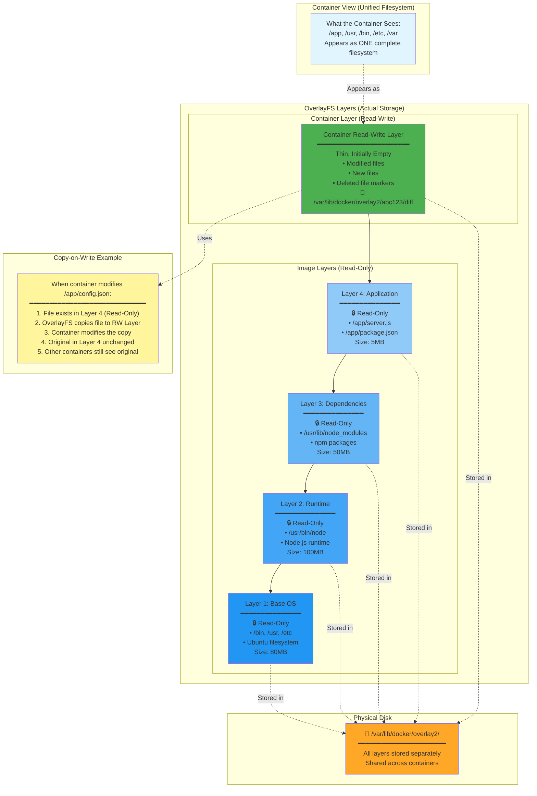
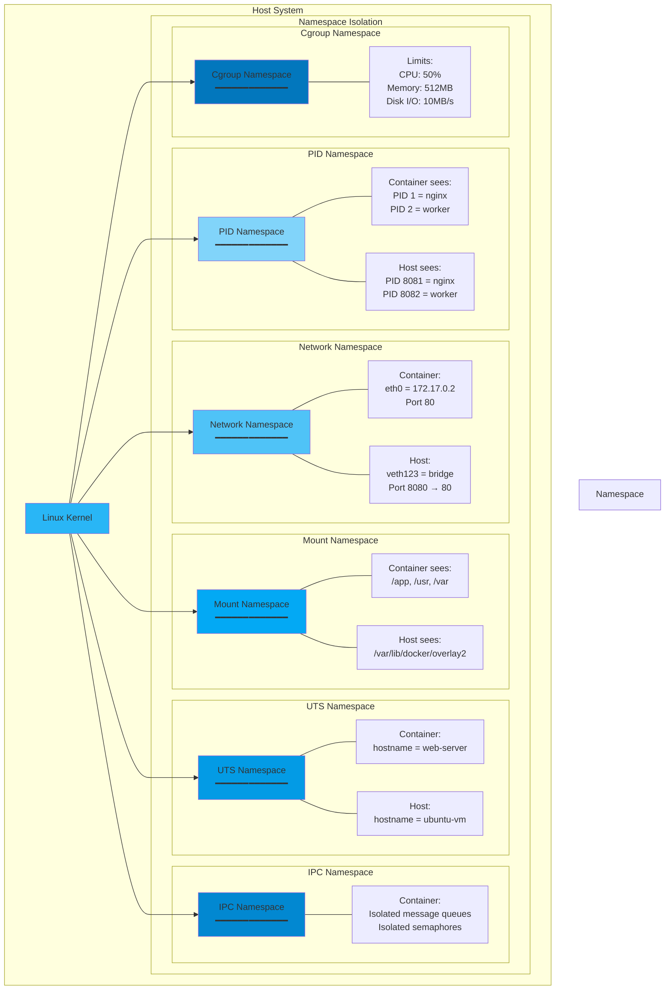

```mermaid
graph TB
    subgraph "Container View (Unified Filesystem)"
        Unified["What the Container Sees:<br/>/app, /usr, /bin, /etc, /var<br/>Appears as ONE complete filesystem"]
    end

    subgraph "OverlayFS Layers (Actual Storage)"

        subgraph "Container Layer (Read-Write)"
            RW["Container Read-Write Layer<br/>━━━━━━━━━━━━━━━━━━━━━━━<br/>Thin, Initially Empty<br/>• Modified files<br/>• New files<br/>• Deleted file markers<br/>📁 /var/lib/docker/overlay2/abc123/diff"]
        end

        subgraph "Image Layers (Read-Only)"
            Layer4["Layer 4: Application<br/>━━━━━━━━━━━━━━━<br/>🔒 Read-Only<br/>• /app/server.js<br/>• /app/package.json<br/>Size: 5MB"]

            Layer3["Layer 3: Dependencies<br/>━━━━━━━━━━━━━━━<br/>🔒 Read-Only<br/>• /usr/lib/node_modules<br/>• npm packages<br/>Size: 50MB"]

            Layer2["Layer 2: Runtime<br/>━━━━━━━━━━━━━━━<br/>🔒 Read-Only<br/>• /usr/bin/node<br/>• Node.js runtime<br/>Size: 100MB"]

            Layer1["Layer 1: Base OS<br/>━━━━━━━━━━━━━━━<br/>🔒 Read-Only<br/>• /bin, /usr, /etc<br/>• Ubuntu filesystem<br/>Size: 80MB"]
        end
    end

    subgraph "Physical Disk"
        Disk["💾 /var/lib/docker/overlay2/<br/>━━━━━━━━━━━━━━━━━━━━━━<br/>All layers stored separately<br/>Shared across containers"]
    end

    subgraph "Copy-on-Write Example"
        COW["When container modifies /app/config.json:<br/>━━━━━━━━━━━━━━━━━━━━━━━━━━━━━<br/>1. File exists in Layer 4 (Read-Only)<br/>2. OverlayFS copies file to RW Layer<br/>3. Container modifies the copy<br/>4. Original in Layer 4 unchanged<br/>5. Other containers still see original"]
    end

    Unified -.Appears as.-> RW
    RW --> Layer4
    Layer4 --> Layer3
    Layer3 --> Layer2
    Layer2 --> Layer1

    Layer1 -.Stored in.-> Disk
    Layer2 -.Stored in.-> Disk
    Layer3 -.Stored in.-> Disk
    Layer4 -.Stored in.-> Disk
    RW -.Stored in.-> Disk

    RW -.Uses.-> COW

    style Unified fill:#e1f5fe
    style RW fill:#4caf50
    style Layer4 fill:#90caf9
    style Layer3 fill:#64b5f6
    style Layer2 fill:#42a5f5
    style Layer1 fill:#2196f3
    style Disk fill:#ffa726
    style COW fill:#fff59d
```

```mermaid
graph TB
    subgraph "Host System"
        Kernel[Linux Kernel]

        subgraph "Namespace Isolation"
            style Namespace Isolation fill:#f0f0f0

            subgraph "PID Namespace"
                PID["PID Namespace<br/>━━━━━━━━━━━━━"]
                PID1["Container sees:<br/>PID 1 = nginx<br/>PID 2 = worker"]
                PID2["Host sees:<br/>PID 8081 = nginx<br/>PID 8082 = worker"]
                PID --- PID1
                PID --- PID2
            end

            subgraph "Network Namespace"
                NET["Network Namespace<br/>━━━━━━━━━━━━━"]
                NET1["Container:<br/>eth0 = 172.17.0.2<br/>Port 80"]
                NET2["Host:<br/>veth123 = bridge<br/>Port 8080 → 80"]
                NET --- NET1
                NET --- NET2
            end

            subgraph "Mount Namespace"
                MNT["Mount Namespace<br/>━━━━━━━━━━━━━"]
                MNT1["Container sees:<br/>/app, /usr, /var"]
                MNT2["Host sees:<br/>/var/lib/docker/overlay2"]
                MNT --- MNT1
                MNT --- MNT2
            end

            subgraph "UTS Namespace"
                UTS["UTS Namespace<br/>━━━━━━━━━━━━━"]
                UTS1["Container:<br/>hostname = web-server"]
                UTS2["Host:<br/>hostname = ubuntu-vm"]
                UTS --- UTS1
                UTS --- UTS2
            end

            subgraph "IPC Namespace"
                IPC["IPC Namespace<br/>━━━━━━━━━━━━━"]
                IPC1["Container:<br/>Isolated message queues<br/>Isolated semaphores"]
                IPC --- IPC1
            end

            subgraph "Cgroup Namespace"
                CGROUP["Cgroup Namespace<br/>━━━━━━━━━━━━━"]
                CGROUP1["Limits:<br/>CPU: 50%<br/>Memory: 512MB<br/>Disk I/O: 10MB/s"]
                CGROUP --- CGROUP1
            end
        end
    end

    Kernel --> PID
    Kernel --> NET
    Kernel --> MNT
    Kernel --> UTS
    Kernel --> IPC
    Kernel --> CGROUP

    style Kernel fill:#29b6f6
    style PID fill:#81d4fa
    style NET fill:#4fc3f7
    style MNT fill:#03a9f4
    style UTS fill:#039be5
    style IPC fill:#0288d1
    style CGROUP fill:#0277bd
```
